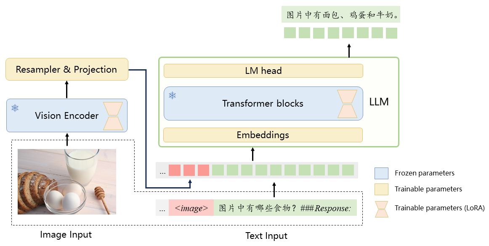
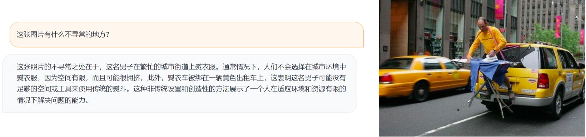
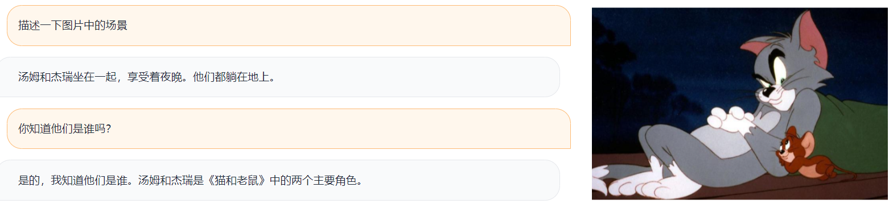
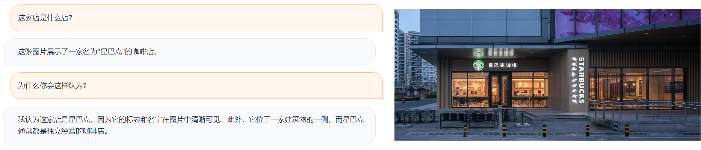

[**🇨🇳中文**](./README.md) | [**🌐English**](./README_EN.md)

<p align="center">
    <br>
    
    <br>
</p>

<p align="center">


<a href='https://huggingface.co/ziqingyang/visualcla-7b-v0.1'></a>
</p>

**Visual-Chinese-LLaMA-Alpaca**（**VisualCLA**）是基于[中文LLaMA&Alpaca大模型](https://github.com/ymcui/Chinese-LLaMA-Alpaca)项目开发的多模态中文大模型。VisualCLA在中文LLaMA/Alpaca模型上增加了图像编码等模块，使LLaMA模型可以接收视觉信息。在此基础上，使用了中文图文对数据进行了多模态预训练，对齐图像与文本表示，赋予其基本的多模态理解能力；并使用多模态指令数据集精调，增强其对多模态指令的理解、执行和对话能力。

**本项目仍处于开发阶段，目前发布的是供预览的测试版本，模型效果还在优化中。**

本项目主要内容：
* 🚀 基于Chinese-LLaMA-Alpaca的多模态模型VisualCLA，具备多模态指理解和对话能力
* 🚀 提供了推理代码和基于Gradio/Text-Generation-WebUI的部署脚本
* 🚀 展示了模型在多模态指令理解任务上的效果，并开放了翻译的测试集
* 🚀 目前开源版本： VisualCLA-7B-v0.1（测试版）

## 演示示例 <!-- omit from toc --> 

<p align="center">
    <br>
    
    <br>
</p>
<p align="center">

----

[**中文LLaMA-2&Alpaca-2大模型**](https://github.com/ymcui/Chinese-LLaMA-Alpaca-2) | [中文LLaMA&Alpaca大模型](https://github.com/ymcui/Chinese-LLaMA-Alpaca/tree/main) | [多模态VLE](https://github.com/iflytek/VLE) | [中文MiniRBT](https://github.com/iflytek/MiniRBT) | [中文LERT](https://github.com/ymcui/LERT) | [中英文PERT](https://github.com/ymcui/PERT) | [中文MacBERT](https://github.com/ymcui/MacBERT) | [中文ELECTRA](https://github.com/ymcui/Chinese-ELECTRA) | [中文XLNet](https://github.com/ymcui/Chinese-XLNet) | [中文BERT](https://github.com/ymcui/Chinese-BERT-wwm) | [知识蒸馏工具TextBrewer](https://github.com/airaria/TextBrewer) | [模型裁剪工具TextPruner](https://github.com/airaria/TextPruner)

## 新闻 <!-- omit from toc --> 

**[2023/07/18] Demo添加了Webcam支持，可以从直接摄像头拍摄照片**

## 内容导引 <!-- omit from toc --> 

- [模型介绍](#模型介绍)
- [模型下载](#模型下载)
- [模型使用](#模型使用)
- [效果展示](#效果展示)
- [局限性](#局限性)


## 模型介绍

Visual-Chinese-LLaMA-Alpaca（VisualCLA）是一个支持图像和文本输入的中文多模态模型。VisualCLA在中文Alpaca模型的基础上，添加了图像编码模块，使中文Alpaca模型能理解视觉信息。

<p align="center">
    <br>
    
    <br>
</p>
<p align="center">

VisualCLA由Vision Encoder、Resampler和LLM三部分组成：

* **Vision Encoder**：采用ViT结构，对输入图像编码，得到图像的序列表示。发布的VisualCLA模型采用了CLIP-ViT-L/14作为图像编码器的结构和初始化权重。
* **Resampler**：采用6层的类BERT结构，其结构与功能类似于Flamingo中的Perceiver Resampler或BLIP-2中的Q-Former，通过可训练的query向量对图像表示进行重采样，减小图像表示的长度。然后，通过线性层将图形表示对齐到LLM的维度。该部分的参数从头开始训练。
* **LLM**：采用LLaMA模型，并使用Chinese-Alpaca-Plus 7B初始化。

图像经过Vision Encoder编码，通过Resampler映射为固定长度的表示。随后，将图像和文本表示拼接后送入LLM。LLM根据图像和文本指令生成结果。

### 训练策略

与Chinese-LLaMA-Alpaca类似，VisualCLA采用LoRA对模型进行高效精调。可训练参数包括图像编码器的LoRA参数，LLM的LoRA参数以及Resampler的全部参数。可参考模型结构图中的说明。训练过程分为两个阶段：

* **多模态预训练**：采用中文图文对数据训练，模型根据图像生成对应的文本描述（caption）。
* **多模态指令精调**：基于上一步得到的模型，在由多种有监督任务数据构建的多模态指令数据集上精调。数据集中包括视觉问答、视觉推理、开放域问答、OCR等任务类型。同时也混入了一部分纯文本指令数据，弥补多模态数据的不足以及缓解遗忘指令跟随能力。该阶段使用了与Chinese-Alpaca模型相同的指令模版。

VisualCLA-7B-v0.1的训练相关信息总结于下表：

|  训练阶段 |  多模态预训练 | 多模态指令精调 |
|---|:---:|:---:|
| 初始化 |  Chinese-Alpaca-Plus 7B | 多模态预训练模型 |
| 训练任务 | 多模态预训练 | 多模态指令精调 |
| 任务类型 | 图像描述（Captioning）| 视觉问答、视觉推理、开放域问答、OCR等 |
| Prompt模版 | 无 | Alpaca prompt模版 |
| 训练集大小（样本数量） | 23M |  350K（多模态指令） + 1.3M（纯文本指令） |


## 模型下载

因[LLaMA模型禁止商用](https://github.com/facebookresearch/llama)，为了遵循相应的许可，本项目发布增量权重，包括：

- LLaMA的LoRA、embedding和LM head权重
- CLIP-ViT的LoRA权重
- Resampler的全部权重

用户需要在**Chinese-Alpaca-Plus**和**CLIP-ViT**的基础上加载或合并模型，以得到完整可用的VisualCLA模型。


| 模型名                        | 依赖的基模型  | 增量权重下载    |
| :---------------------------- | :-----------------: | :-------: |
| **VisualCLA-7B-v0.1** | Chinese-Alpaca-Plus 7B (HF格式)<sup>&dagger;</sup> + CLIP-ViT-L/14<sup>&Dagger;</sup> |  [[百度网盘]](https://pan.baidu.com/s/1bBF5QHoZxHRnWeTPHL19CQ?pwd=xxbg)</br>[[Google Drive]](https://drive.google.com/file/d/1fWN57u2oh8VfFtcKsZTv-90Z2cczGfcJ/view?usp=sharing) |

&dagger;: Chinese-Alpaca-Plus 7B模型的获取与合并方法请参考[Chinese-LLaMA-Alpaca模型合并与转换](https://github.com/ymcui/Chinese-LLaMA-Alpaca/wiki/模型合并与转换)

&Dagger;: CLIP-ViT-L/14模型[下载链接](https://huggingface.co/openai/clip-vit-large-patch14)

### Model Hub

也可以在🤗Model Hub下载模型，使用transformers和PEFT调用VisualCLA。以下模型调用名称指的是使用`.from_pretrained()`中指定的模型名称。使用示例可参见[模型使用](#模型使用)。

| 模型名                        | 模型调用名称  | 链接   |
| ---------------------------- | :----------- | :-------: |
| **VisualCLA-7B-v0.1** | ziqingyang/visualcla-7b-v0.1  |  [Hub地址](https://huggingface.co/ziqingyang/visualcla-7b-v0.1) |


压缩包内包含如下文件：
```
visualcla-7b-v0.1/
  - adapter_config.json      # LoRA配置文件
  - adapter_model.bin        # LoRA权重文件
  - config.json              # VisualCLA配置文件
  - added_tokens.json        # tokenizer配置文件
  - special_tokens_map.json  # tokenizer配置文件
  - tokenizer_config.json    # tokenizer配置文件
  - tokenizer.model          # tokenizer文件
  - preprocessor_config.json # ImageProcessor配置文件
```

## 模型使用

### Colab笔记本

对于模型的安装、合并、推理和部署等流程，除了下述的步骤说明外，我们还提供了Colab笔记本，用户可方便地直接执行、体验并查看结果：

| 笔记本名                        | 内容 | 链接   | notebook文件 |
| ---------------------------- | ----------------- | ------- | ----- |
| **visualcla_inference.ipynb** | 模型的安装、合并、命令行推理和Gradio demo部署 | [](https://colab.research.google.com/drive/17k4tPYCaCdtHYmHGAV-WkPO9Nud2L_be?usp=sharing) | [visualcla_inference.ipynb](notebooks/visualcla_inference.ipynb) |

### 安装

将本项目下载至本地，安装模型代码至Python搜索路径

```bash
git clone https://github.com/airaria/Visual-Chinese-LLaMA-Alpaca
cd Visual-Chinese-LLaMA-Alpaca
pip install -e .
```

### 合并模型（可选，推荐）

用户可以选择将增量权重与基模型合并后保存，使用更方便，加载更迅速。合并后的模型大小约为14G，合并过程约需占用20G内存，请确保机器有足够的硬盘和内存空间。

执行本项目中的`scripts/merge_llama_with_vcla_lora.py`进行合并：

```bash
python scripts/merge_llama_with_visualcla_lora.py \
    --text_model /path/to/chinese/alpaca/plus/7b \
    --vision_model /path/to/clip/vit/14-L \
    --lora_model /path/to/visualcla/lora \
    --output_dir output_dir
```

参数说明：

* `--text_model`：Chinese-Alpaca-Plus 7B模型所在目录
* `--vision_model`：CLIP-ViT-14/L模型所在目录
* `--lora_model`：VisualCLA LoRA模型所在目录
* `--output_dir`：保存合并后模型的目录

传入的模型所在目录也皆可用🤗Model Hub上的模型名代替。

合并后的`output_dir`目录内容如下：
```bash
output_dir/
 - text_encoder/             # LLM的模型权重和配置
 - image_encoer/             # Vision Encoder的模型权重和配置
 - pytorch_model.bin         # Resampler部分的权重
 - config.json               # VisualCLA的配置文件
 - added_tokens.json         # tokenizer配置文件
 - special_token_map.json    # tokenizer配置文件
 - tokenizer_config.json     # tokenizer配置文件
 - tokenizer.model           # tokenizer文件
 - preprocessor_config.json  # ImageProcessor配置文件

```

可以使用`visualcla.get_model_and_tokenizer_and_processor`加载，详见下节。

### 模型加载与推理

#### 接口调用

**如果已[合并模型](#合并模型可选推荐)**：

可以使用如下代码在Python程序中调用VisualCLA:

```python
import torch
import visualcla
model, tokenizer, _ = visualcla.get_model_and_tokenizer_and_processor(
      visualcla_model="/path/to/the/merged/visualcla/model",
      torch_dtype=torch.float16,
      load_in_8bit=True
)
model.to(0)
history=[]
visualcla.chat(model=model, image="path/to/image/filename", text="your instruction here", history=history)
```

**如果未[合并模型](#合并模型可选推荐)**：

需要同时加载Chinese-Alpaca-Plus-7B，CLIP-ViT-L/14和VisualCLA LoRA：

```python
import torch
import visualcla
from peft import PeftModel
base_model, tokenizer, _ = visualcla.get_model_and_tokenizer_and_processor(
      text_model="/path/to/chinese/alpaca/plus/7b",  # Path to the Chinese-Alpaca-Plus 7B model
      vision_model="openai/clip-vit-large-patch14",  # We can also use the Model Hub name of the model
      lora_model="/path/to/visualcla/lora",
      torch_dtype=torch.float16
)
base_model.resize_token_embeddings(len(tokenizer))
model = PeftModel.from_pretrained(base_model, "/path/to/visualcla/lora", torch_dtype=torch.float16)
model.to(0)
history = []
visualcla.chat(model=model, image="path/to/image/filename", text="your instruction here",history=history)
```

#### 推理脚本


在本项目的`scripts/inference`文件夹下提供了封装更完善的Python推理脚本`inference.py`

**如果已[合并模型](#合并模型可选推荐)**：
```bash
python scripts/inference/inference.py \
    --visualcla_model visualcla_model \
    --image_file image_file \
    --load_in_8bit
```

**如果未[合并模型](#合并模型可选推荐)**：
```bash
python scripts/inference/inference.py \
    --text_model /path/to/chinese/alpaca/plus/7b \
    --vision_model /path/to/clip/vit/14-L \
    --lora_model /path/to/visualcla/lora \
    --image_file image_file
    # 未合并的模型暂不支持8bit加载
```

参数说明：

* `--text_model`：合并后的Chinese-Alpaca-Plus 7B模型所在目录，或🤗Model Hub上的模型名
* `--vision_model`：CLIP-ViT-14/L模型所在目录，或🤗Model Hub上的模型名
* `--lora_model`：VisualCLA LoRA模型所在目录，或🤗Model Hub上的模型名
* `--visualcla_model`：使用合并脚本合并后的VisualCLA模型
   - 若未提供此参数，则模型将合并`text_model`，`vision_model`和`lora_model`并用于推理
   - 若提供此参数，则加载的模型将以此参数为准，无需再提供 `text_model`，`vision_model`和`lora_model`
* `--image_file`（可选）：模型读入的图片名，支持`png`，`jpg`等标准图片格式。不提供此参数时，模型将只基于文本内容进行回复。
* `--load_in_8bit`（可选）：LLM部分是否使用8bit推理
* `--gpus`（可选）：使用的GPU设备id，默认为0
* `--only_cpu`（可选）：是否仅使用CPU推理

### 模型部署

#### 基于Gradio的网页demo

先安装依赖包
```bash
pip install gradio mdtex2html
```
启动方式：
```
python scripts/inference/gradio_demo.py --visualcla_model visualcla_model --load_in_8bit
```
参数说明：

* `--visualcla_model`：使用合并脚本合并后的VisualCLA模型
* `--share`（可选）：是否创建公开可访问链接
* `--load_in_8bit`（可选）：LLM部分是否使用8bit推理
* `--gpus`（可选）：使用的GPU设备id，默认为0
* `--only_cpu`（可选）：是否仅使用CPU推理
* `--no_stream`（可选）：不使用流式输出形式


### 基于Text-Generation-webUI的模型部署

相比基于`gradio_demo.py`的部署方式，Text-Generation-webUI支持在多轮对话中使用多张图片。基于Text-Generation-webUI的模型部署的详细步骤请参考[这里](scripts/inference/text_generation_webui/README.md)。

## 效果展示

以下展示的均是v0.1测试版的效果










### 中文测试集

我们将[LLaVA](https://github.com/haotian-liu/LLaVA)测试集和[OwlEval](https://github.com/X-PLUG/mPLUG-Owl)测试集翻译成了中文，数据集下载以及模型在这两个数据集上的结果参见[此处](examples/)。

## 局限性

虽然本项目中的模型具备一定的结合图像的多模态理解和生成能力，但也存在一定局限性，包括但不限于：

* 存在幻觉问题，可能会生成与图像内容不符或不相关的内容，比如描述了图片中不存在的物体等
* 预训练仍不充分，可能出现指令理解错误以及不能很好地结合图片回答等情况
* 对图像中的精细的文字、公式、表格等内容的识别和理解准确率较低
* 进行多轮对话后模型输出质量变差
* 没有在线可互动的demo（注：用户仍然可以自行在本地部署）


## 引用 <!-- omit from toc --> 

如果您觉得本项目对您的研究有所帮助或使用了本项目的代码或数据，请参考引用我们的工作

```
@article{chinese-llama-alpaca,
      title={Efficient and Effective Text Encoding for Chinese LLaMA and Alpaca}, 
      author={Cui, Yiming and Yang, Ziqing and Yao, Xin},
      journal={arXiv preprint arXiv:2304.08177},
      url={https://arxiv.org/abs/2304.08177},
      year={2023}
}

@misc{visualcla,
  author = {Yang, Ziqing and Pan, Yuchen and Cui, Yiming},
  title = {Visual-Chinese-LLaMA-Alpaca},
  year = {2023},
  publisher = {GitHub},
  journal = {GitHub repository},
  howpublished = {\url{https://github.com/airaria/Visual-Chinese-LLaMA-Alpaca/}},
}
```

## 致谢 <!-- omit from toc --> 

本项目基于以下开源项目二次开发，在此对相关项目和研究开发人员表示感谢。

* 基础模型
  *  使用了[LLaMA](https://github.com/facebookresearch/llama)和[CLIP](https://github.com/openai/CLIP)的预训练权重
  *  模型结构参考了[BLIP-2](https://github.com/salesforce/LAVIS)和[Flamingo](https://github.com/lucidrains/flamingo-pytorch)
*  推理与部署
   *  [text-generation-webui](https://github.com/oobabooga/text-generation-webui)
*  多模态数据
   *  SFT训练中使用了[LLaVA](https://github.com/haotian-liu/LLaVA)，[MiniGPT-4](https://github.com/Vision-CAIR/MiniGPT-4)以及其他经典多模态任务数据集

## 免责声明 <!-- omit from toc --> 

**本项目相关资源仅供学术研究之用，严禁用于商业用途。** 使用涉及第三方代码的部分时，请严格遵循相应的开源协议。模型生成的内容受模型计算、随机性和量化精度损失等因素影响，本项目不对其准确性作出保证。对于模型输出的任何内容，本项目不承担任何法律责任，亦不对因使用相关资源和输出结果而可能产生的任何损失承担责任。

本项目由个人及协作者业余时间发起并维护，因此无法保证能及时回复解决相应问题。
