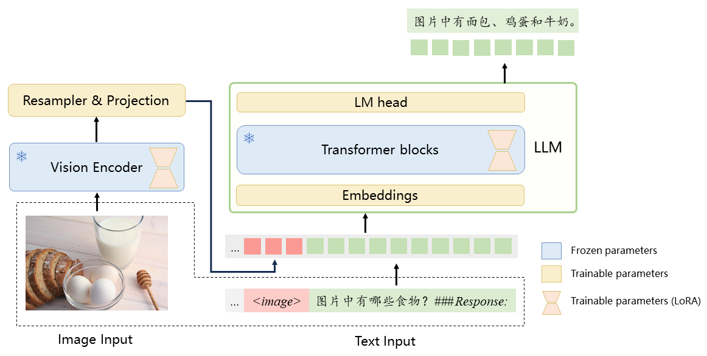
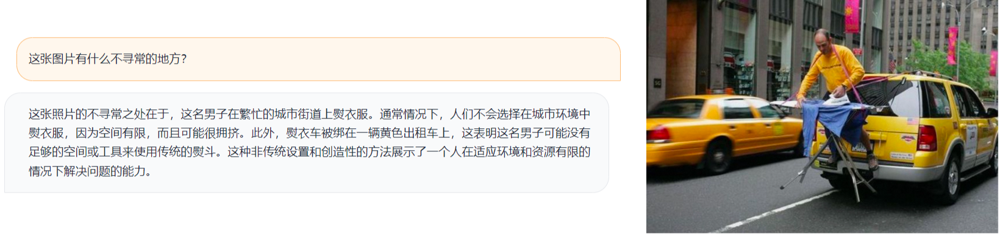
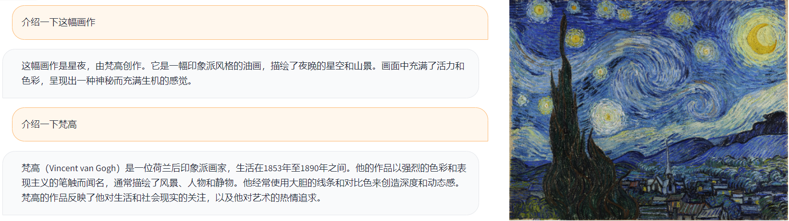
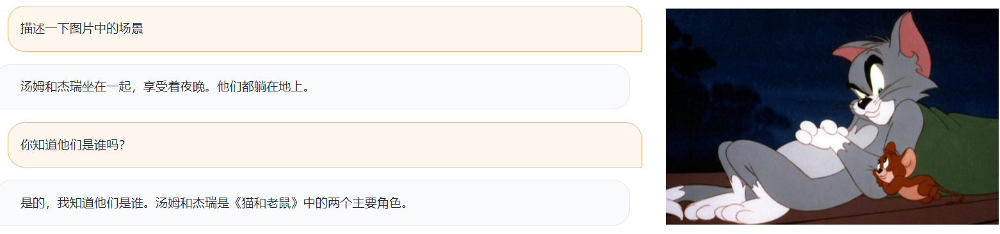
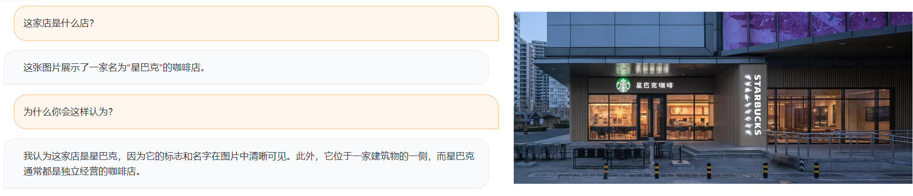

[**🇨🇳中文**](./README.md) | [**🌐English**](./README_EN.md)

<p align="center">
    <br>
    
    <br>
</p>

<p align="center">


<a href='https://huggingface.co/ziqingyang/visualcla-7b-v0.1'></a>
</p>

**Visual-Chinese-LLaMA-Alpaca** (VisualCLA) is a multimodal Chinese large language model developed based on the [Chinese-LLaMA-Alpaca](https://github.com/ymcui/Chinese-LLaMA-Alpaca) project. VisualCLA adds modules for image encoding to the Chinese LLaMA/Alpaca model, enabling the LLaMA model to process visual information. Building upon this, VisualCLA performs multimodal pre-training on Chinese image-text pairs, aligning image and text representations to imbue the model with basic multimodal understanding capabilities. It is further fine-tuned using a multimodal instruction dataset to enhance its understanding, execution, and dialogue capabilities with multimodal instructions.

**This project is still in the development stage, and the released version is a preview test version. Model performance is to be optimized.**

The main features of this project include:

* 🚀 VisualCLA, a multimodal model based on Chinese-LLaMA-Alpaca, with capabilities for multimodal instruction understanding and dialogue.
* 🚀 Provides inference code and deployment scripts based on Gradio/Text-Generation-WebUI.
* 🚀 Demonstrates the model's performance on the multimodal instruction understanding task and provides a test set for translation.
* 🚀 Current open-source version: VisualCLA-7B-v0.1 (test version).

# Demonstration  <!-- omit from toc --> 

<p align="center">
    <br>
    
    <br>
</p>
<p align="center">

----

[**Chinese-LLaMA-Alpaca-2**](https://github.com/ymcui/Chinese-LLaMA-Alpaca-2) | [Chinese-LLaMA-Alpaca](https://github.com/ymcui/Chinese-LLaMA-Alpaca) | [Multi-modal VLE](https://github.com/iflytek/VLE) | [Chinese MiniRBT](https://github.com/iflytek/MiniRBT) | [Chinese LERT](https://github.com/ymcui/LERT) | [Chinese-English PERT](https://github.com/ymcui/PERT) | [Chinese MacBERT](https://github.com/ymcui/MacBERT) | [Chinese ELECTRA](https://github.com/ymcui/Chinese-ELECTRA) | [Chinese XLNet](https://github.com/ymcui/Chinese-XLNet) | [Chinese BERT](https://github.com/ymcui/Chinese-BERT-wwm) | [Knowledge distillation tool TextBrewer](https://github.com/airaria/TextBrewer) | [Model pruning tool TextPruner](https://github.com/airaria/TextPruner)

## News <!-- omit from toc --> 

[2023/07/18] Add webcam support for Gradio demo: Users can take and upload their images with their webcams

## Table of Contents <!-- omit from toc --> 

- [Intruction](#intruction)
- [Download](#download)
- [Usage](#usage)
- [Examples](#examples)
- [Limitations](#limitations)


## Intruction

Visual-Chinese-LLaMA-Alpaca (VisualCLA) is a Chinese multimodal model that supports both image and text inputs. VisualCLA is built upon the Chinese Alpaca model and incorporates an image encoding module, enabling the Chinese Alpaca model to comprehend visual information.

<p align="center">
    <br>
    
    <br>
</p>
<p align="center">

VisualCLA consists of three components: Vision Encoder, Resampler, and LLM.

**Vision Encoder**: It adopts the ViT (Vision Transformer) architecture to encode the input images and obtain a sequential representation of the images. The released VisualCLA model uses CLIP-ViT-L/14 as the structure and initialization weights for the image encoder.

**Resampler**: It utilizes a 6-layer BERT-like structure. Its design and functionality are similar to the Perceiver Resampler in Flamingo or the Q-Former in BLIP-2. The Resampler employs a trainable query vector to resample the image representation, reducing its length. Then, a linear layer aligns the image representation to the dimensions of LLM. The parameters of this component are trained from scratch.

**LLM**: It employs the LLaMA model and utilizes the Chinese-Alpaca-Plus 7B initialization.

The images are encoded by the Vision Encoder and then mapped to a fixed-length representation through the Resampler. Afterwards, the image and text representations are concatenated and fed into LLM. LLM generates results based on the image and text instructions.


### Training Strategy


Similar to Chinese-LLaMA-Alpaca, VisualCLA utilizes LoRA for efficient fine-tuning of the model. The trainable parameters include LoRA parameters for the image encoder, LoRA parameters for LLM, and all parameters for the Resampler. Please refer to the explanatory diagram in the model structure for more details. The training process consists of two stages:

**Multimodal Pretraining**: Trained on Chinese image-text pairs, the model generates corresponding textual descriptions (captions) based on the images.
**Multimodal Instruction Fine-tuning**: Based on the model obtained in the previous step, fine-tuning is performed on a multimodal instruction dataset constructed from various supervised tasks. The dataset includes tasks such as visual question answering, visual reasoning, open-domain question answering, OCR, etc. It also incorporates a portion of pure text instruction data to compensate for the limitations of multimodal data and alleviate the issue of forgetting instruction-following capabilities. This stage employs the same instruction templates as the Chinese-Alpaca model.

The training-related information for VisualCLA-7B-v0.1 is summarized in the table below:

|  Training Stage |  Multimodal Pretraining | Multimodal Instruction Fine-tuning |
|---|:---:|:---:|
| Initialization |  Chinese-Alpaca-Plus 7B | Multimodal Pretrained Model |
| Task | Multimodal Pretraining | Multimodal Instruction Fine-tuning |
| Task type | Captioning| VQA, Open VQA, OCR, etc. |
| Prompt | None | Alpaca prompt |
| Training data size | 23M |  350K（Multimodal instructions） + 1.3M（text instructions） |


## Download

Due to the commercial restriction on the LLaMA model, as stated in its license, this project releases incremental weights, including:

- LoRA, embedding, and LM head weights from LLaMA
- LoRA weights from CLIP-ViT
- All weights from Resampler

Users need to load or merge the models based on **Chinese-Alpaca-Plus** and **CLIP-ViT** in order to obtain a fully functional VisualCLA model.

| Model name                       | Base model  | Incremental weights   |
| :---------------------------- | :-----------------: | :-------: |
| **VisualCLA-7B-v0.1** | Chinese-Alpaca-Plus 7B (HF format)<sup>&dagger;</sup> + CLIP-ViT-L/14<sup>&Dagger;</sup> |  [[百度网盘]](https://pan.baidu.com/s/1bBF5QHoZxHRnWeTPHL19CQ?pwd=xxbg)</br>[[Google Drive]](https://drive.google.com/file/d/1fWN57u2oh8VfFtcKsZTv-90Z2cczGfcJ/view?usp=sharing) |

&dagger;: Please refer to [Chinese-LLaMA-Alpaca Model Merging and Conversion](https://github.com/ymcui/Chinese-LLaMA-Alpaca/wiki/模型合并与转换) for the acquisition and merging methods of the Chinese-Alpaca-Plus 7B model.

&Dagger;: CLIP-ViT-L/14 [download link](https://huggingface.co/openai/clip-vit-large-patch14)


### Model Hub

You can also download the model from the 🤗 Model Hub. The MODEL_NAME mentioned below refer to the model names specified in `.from_pretrained()`. For usage examples, please refer to the [Usage](#Usage) section.


| Model name                       | MODEL_NAME  | Link   |
| ---------------------------- | :----------- | :-------: |
| **VisualCLA-7B-v0.1** | ziqingyang/visualcla-7b-v0.1  |  [Hub](https://huggingface.co/ziqingyang/visualcla-7b-v0.1) |

The following files are contained in the zip：
```
visualcla-7b-v0.1/
  - adapter_config.json      # LoRA config
  - adapter_model.bin        # LoRA weight
  - config.json              # VisualCLA config
  - added_tokens.json        # tokenizer config
  - special_tokens_map.json  # tokenizer config
  - tokenizer_config.json    # tokenizer config
  - tokenizer.model          # tokenizer
  - preprocessor_config.json # ImageProcessor config
```

## Usage

### Colab Notebook


For the installation, merging, inference, and deployment processes of the model, in addition to the step-by-step instructions provided below, we also offer a Colab notebook. Users can conveniently execute, experience, and view the results directly using the notebook.

| Notebook name                        | Content | Link   | Notebook file |
| ---------------------------- | ----------------- | ------- | ----- |
| **visualcla_inference.ipynb** | Installation, merging, inference, and deployment | [](https://colab.research.google.com/drive/17k4tPYCaCdtHYmHGAV-WkPO9Nud2L_be?usp=sharing) | [visualcla_inference.ipynb](notebooks/visualcla_inference.ipynb) |

### Installation

Download this project to your local machine and install the model code into the Python search path

```bash
git clone https://github.com/airaria/Visual-Chinese-LLaMA-Alpaca
cd Visual-Chinese-LLaMA-Alpaca
pip install -e .
```


### Merge model (optional, recommaned)

Users can choose to save the merged weights of the incremental model with the base model, which makes it more convenient to use and load faster. The size of the merged model is approximately 14GB, and the merging process requires about 20GB of memory. Please ensure that your machine has enough disk space and memory.

To perform the merging, execute `scripts/merge_llama_with_vcla_lora.py`:

```bash
python scripts/merge_llama_with_visualcla_lora.py \
    --text_model /path/to/chinese/alpaca/plus/7b \
    --vision_model /path/to/clip/vit/14-L \
    --lora_model /path/to/visualcla/lora \
    --output_dir output_dir
```

Parameters:

* `--text_model`：Chinese-Alpaca-Plus 7B model
* `--vision_model`：CLIP-ViT-14/L model
* `--lora_model`：VisualCLA LoRA model
* `--output_dir`：dir to save the merged model

The model name can also be the name on the 🤗Model Hub.

The contents of `output_dir`:
```bash
output_dir/
 - text_encoder/             # LLM config and weight
 - image_encoer/             # Vision Encoder config and weight
 - pytorch_model.bin         # Resampler weight
 - config.json               # VisualCLA config 
 - added_tokens.json         # tokenizer config 
 - special_token_map.json    # tokenizer config 
 - tokenizer_config.json     # tokenizer config 
 - tokenizer.model           # tokenizer
 - preprocessor_config.json  # ImageProcessor config 

```

Then use `visualcla.get_model_and_tokenizer_and_processor` to load the model, see next section for details.


### Loading and Inference

#### API

**If model has been merged**:

```python
import torch
import visualcla
model, tokenizer, _ = visualcla.get_model_and_tokenizer_and_processor(
      visualcla_model="/path/to/the/merged/visualcla/model",
      torch_dtype=torch.float16,
      load_in_8bit=True
)
model.to(0)
history=[]
visualcla.chat(model=model, image="path/to/image/filename", text="your instruction here", history=history)
```

**If model has not been merged**:

```python
import torch
import visualcla
from peft import PeftModel
base_model, tokenizer, _ = visualcla.get_model_and_tokenizer_and_processor(
      text_model="/path/to/chinese/alpaca/plus/7b",  # Path to the Chinese-Alpaca-Plus 7B model
      vision_model="openai/clip-vit-large-patch14",  # We can also use the Model Hub name of the model
      lora_model="/path/to/visualcla/lora",
      torch_dtype=torch.float16
)
base_model.resize_token_embeddings(len(tokenizer))
model = PeftModel.from_pretrained(base_model, "/path/to/visualcla/lora", torch_dtype=torch.float16)
model.to(0)
history = []
visualcla.chat(model=model, image="path/to/image/filename", text="your instruction here",history=history)
```

#### Inference Script

We provide a convinient script for inference `inference.py` under `scripts/inference`

**If model has been merged**:
```bash
python scripts/inference/inference.py \
    --visualcla_model visualcla_model \
    --image_file image_file \
    --load_in_8bit
```

**If model has not been merged**:
```bash
python scripts/inference/inference.py \
    --text_model /path/to/chinese/alpaca/plus/7b \
    --vision_model /path/to/clip/vit/14-L \
    --lora_model /path/to/visualcla/lora \
    --image_file image_file
    # load_in_8bit is not supported
```

Parameters:

* `--text_model`：Merged Chinese-Alpaca-Plus 7B folder, or MODEL_NAME on 🤗Model Hub
* `--vision_model`：CLIP-ViT-14/L folder，or MODEL_NAME on 🤗Model Hub
* `--lora_model`：VisualCLA LoRA folder，or MODEL_NAME on 🤗Model Hub
* `--visualcla_model`：Merged VisualCLA model
   - If not provided，the `text_model`, `vision_model` and `lora_model` will be merged for inference
   - If provided, no need to provide `text_model`，`vision_model` and `lora_model`
* `--image_file` (optional)：The input image filename, in `png`, `jpg` and other formats. If not provided, model will response based only on the text.
* `--load_in_8bit` (optional)：If use 8bit for LLM inference
* `--gpus` (optional)：GPU ids，default 0
* `--only_cpu` (optional)：Use cpu or not

### Deployment

#### Gradio Demo

Install the dependencies
```bash
pip install gradio mdtex2html
```
Run:
```
python scripts/inference/gradio_demo.py --visualcla_model visualcla_model --load_in_8bit
```

Parameters:

* `--visualcla_model`：Merged VisualCLA model
* `--share` (optional)：if create public shared link
* `--load_in_8bit` (optional)：If use 8bit for LLM inference
* `--gpus` (optional)：GPU ids，default 0
* `--only_cpu` (optional)：Use cpu or not
* `--no_stream` (optional)：Not using streaming output


### Text-Generation-webUI

Compared to the deployment method based `gradio_demo.py``, the Text-Generation-webUI supports the use of multiple images in multi-turn conversations. For detailed steps on deploying a model based on Text-Generation-webUI, please refer to [this link](scripts/inference/text_generation_webui/README.md).


## Examples

The following demonstrations showcase the results of version 0.1












### Chinese testsets

We have translated [LLaVA](https://github.com/haotian-liu/LLaVA) and [OwlEval](https://github.com/X-PLUG/mPLUG-Owl) test sets to Chinese. The translated datasets and the model results can be found [here](examples/).


## Limitations

Although the models in this project have certain capabilities to integrate and generate multimodal understanding of images, they also have certain limitations, including but not limited to:

* The existence of hallucination problems, which may generate content that is inconsistent or irrelevant to the image, such as describing objects that do not exist in the picture.
* Insufficient pre-training, which may result in errors in understanding instructions and difficulties in effectively combining images to provide answers.
* Lower accuracy in recognizing and understanding fine details in images, such as text, formulas, tables, etc.
* Decreased output quality of the model after multiple rounds of dialogue.
* There is no online interactive demo available (Note: Users can still deploy it locally on their own).*


## Citation <!-- omit from toc --> 

If you find the model, data, code in our project useful, please consider citing our work

```
@article{chinese-llama-alpaca,
      title={Efficient and Effective Text Encoding for Chinese LLaMA and Alpaca}, 
      author={Cui, Yiming and Yang, Ziqing and Yao, Xin},
      journal={arXiv preprint arXiv:2304.08177},
      url={https://arxiv.org/abs/2304.08177},
      year={2023}
}

@misc{visualcla,
  author = {Yang, Ziqing and Pan, Yuchen and Cui, Yiming},
  title = {Visual-Chinese-LLaMA-Alpaca},
  year = {2023},
  publisher = {GitHub},
  journal = {GitHub repository},
  howpublished = {\url{https://github.com/airaria/Visual-Chinese-LLaMA-Alpaca/}},
}
```

## Acknowledgements <!-- omit from toc --> 

This project is based on the following open-source projects for secondary development, and we would like to express our gratitude to the related projects and research and development personnel.

* Base Model
  *  [LLaMA](https://github.com/facebookresearch/llama), [CLIP](https://github.com/openai/CLIP)的预训练权重
  *  The model structure is inspired by [BLIP-2](https://github.com/salesforce/LAVIS) and [Flamingo](https://github.com/lucidrains/flamingo-pytorch)
*  Inference and deployment
   *  [text-generation-webui](https://github.com/oobabooga/text-generation-webui)
*  Multimodal datasets
   *  We used [LLaVA](https://github.com/haotian-liu/LLaVA), [MiniGPT-4](https://github.com/Vision-CAIR/MiniGPT-4) and other classic multimodal datasets during SFT.

## Disclaimer <!-- omit from toc --> 

**The resources related to this project are for academic research purposes only and are strictly prohibited for commercial use.** When using parts involving third-party code, please strictly follow the corresponding open-source agreements. The content generated by the model is affected by factors such as model calculation, randomness, and quantization accuracy loss. This project cannot guarantee its accuracy. For any content output by the model, this project does not assume any legal responsibility and does not assume responsibility for any losses that may result from the use of related resources and output results.

This project is initiated and maintained by individuals and collaborators in their spare time, so we cannot guarantee a timely response to resolving relevant issues.