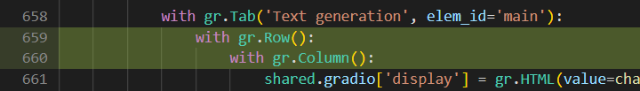

# 使用Text-Generation-webUI搭建交互界面

下面介绍如何通过[Text-Generation-webUI库](https://github.com/oobabooga/text-generation-webui)部署VisualCLA交互界面

## Step 1: 克隆Text-Generation-webUI库

通过以下命令克隆Text-Generation-webUI库，并安装相应的依赖

```bash
git clone https://github.com/oobabooga/text-generation-webui
cd text-generation-webui
pip install -r requirements.txt
```

## Step 2: 复制``extention``相关代码及配置

1. 将[VCLA扩展相关代码](visualcla)目录复制到Text-Generation-webUI库的``extensions/multimodal/pipelines``目录下

```bash
cp -r [Path/For/Visual-Chinese-LLaMA-Alpaca]/scripts/inference/text_generation_webui/visualcla extensions/multimodal/pipelines/
```

2. 将[settings](settings)目录下的配置文件``settings-visualcla.yaml``，
``VisualCLA-Inference.yaml``，
``VisualCLA.yaml``复制到Text-Generation-webUI库下的相应位置。

```bash
cp -r [Path/For/Visual-Chinese-LLaMA-Alpaca]/scripts/inference/text_generation_webui/settings/settings-visualcla.yaml ./
cp -r [Path/For/Visual-Chinese-LLaMA-Alpaca]/scripts/inference/text_generation_webui/settings/VisualCLA-Inference.yaml presets/
cp -r [Path/For/Visual-Chinese-LLaMA-Alpaca]/scripts/inference/text_generation_webui/settings/VisualCLA.yaml characters/instruction-following/
```

复制完成后，text-generation-webui的根目录下应包含以下这些文件：

```
text-generation-webui
  |--characters
  |    |--instruction-following
  |         |--VisualCLA.yaml
  |--extensions
  |    |--multimodal
  |         |--pipelines
  |              |--visualcla
  |--presets
  |    |--VisualCLA-Inference.yaml
  |--settings-visualcla.yaml
```

3. 进入Text-Generation-webUI库根目录，在``models/config.yaml``中添加相关配置：首行加入``visualcla``，然后按如下截图加入相关设置。具体改动可参考[这里](config.yaml)。


## Step 3: 修改text-generation-webui代码

1. 修改图片在指令中的拼接顺序。
在``extensions/multimodal/script.py``中添加``add_chat_picture_visualcla(...)``方法，并在``ui()``方法中将``add_chat_picture``替换为``add_chat_picture_visualcla``。``add_chat_picture_visualcla(...)``方法和具体改动参考[script.py](script.py)


2. 修改``modules/LoRA.py``文件，在``PeftModel.from_pretrained``前添加一行代码，调整embedding size。
```python
shared.model.resize_token_embeddings(len(shared.tokenizer)) # 新加内容
shared.model = PeftModel.from_pretrained(shared.model, Path(f"{shared.args.lora_dir}/{lora_names[0]}"), **params) # 原有代码
```

## Step 4: (可选) UI改动

``server.py``中的改动

（如果除了multimodal扩展之外还使用了其他扩展，该改动可能导致其他扩展的显示异常。）

将``Text generation``模块和``extention``模块改为呈两列显示。具体改动可参考[server.py](server.py)。




``css/chat.js``中的改动

调整模块的宽度。可根据自己的实际情况调整。


## Step 5: 模型权重处理

### 如果已[合并权重](../../../README.md#合并模型可选推荐)（推荐）：

如果已经通过[合并脚本](../../../scripts/merge_llama_with_visualcla_lora.py)将权重合并，只需要将文本端部分权重放到text-generation-webui的``models``目录下，其余权重的加载通过修改``settings-visualcla.yaml``中的参数即可，具体步骤如下：

1. 将合并好的权重的文本端部分（``text_encoder``目录）复制到``models``目录下，注意复制后的目录名。然后，将tokenizer的相关文件复制到该目录下。

```bash
# 复制文本端权重
cp -r [Path/For/Merged_Model]/text_encoder models/visualcla_merged-7b
# 复制 tokenzier 相关文件
cp [Path/For/Merged_Model]/added_tokens.json models/visualcla_merged-7b/
cp [Path/For/Merged_Model]/special_tokens_map.json models/visualcla_merged-7b/
cp [Path/For/Merged_Model]/tokenizer_config.json models/visualcla_merged-7b/
cp [Path/For/Merged_Model]/tokenizer.model models/visualcla_merged-7b/
```

2. 在``settings-visualcla.yaml``中修改``visualcla_merged_model``参数为合并后权重的路径

```yaml
visualcla_merged_model : [Path/For/Merged_Model]
```

### 如果未[合并权重](../../../README.md#合并模型可选推荐)：

如果未合并权重，需要先将权重文件进行转换，然后将文件拷贝到相应位置并修改``settings-visualcla.yaml``。具体步骤如下：

1. 通过[权重转换脚本](convert_ckpt_for_tgwebui.py)转换权重后，得到两个权重目录：文本端权重``[Path/For/Lora_model]_text_lora_model_tgwebui``和图像端权重``[Path/For/Lora_model]_vision_lora_model_tgwebui``。

```bash
python convert_ckpt_for_tgwebui.py \
    --lora_model=[Path/For/Lora_model]
```

2. 将文本端权重``[Path/For/Lora_model]_text_lora_model_tgwebui``复制到``loras``目录下。

```bash
cp -r [Path/For/Lora_model]_text_lora_model_tgwebui loras/visualcla_lora
```

3. 在``settings-visualcla.yaml``中修改``visualcla_vision_lora_model``参数为图像端权重的路径``[Path/For/Lora_model]_vision_lora_model_tgwebui``

```yaml
visualcla_vision_lora_model : [Path/For/Lora_model]_vision_lora_model_tgwebui
```

4. 将``Chinese-alpaca-plus-7b``合并后的权重复制到``models``目录下（Chinese-Alpaca-Plus 7B模型的获取与合并方法请参考[Chinese-LLaMA-Alpaca模型合并与转换](https://github.com/ymcui/Chinese-LLaMA-Alpaca/wiki/模型合并与转换)），并将VisualCLA的tokenizer的相关文件复制到该目录下。

```bash
# 复制 Chinese-alpaca-plus-7b 权重
cp -r [Path/For/Chinese-alpaca-plus-7b] models/chinese-alpaca-plus-7b
# 复制 tokenizer 相关文件
cp [Path/For/Lora_model]/added_tokens.json models/visualcla_merged-7b/
cp [Path/For/Lora_model]/special_tokens_map.json models/visualcla_merged-7b/
cp [Path/For/Lora_model]/tokenizer_config.json models/visualcla_merged-7b/
cp [Path/For/Lora_model]/tokenizer.model models/visualcla_merged-7b/
```

## Step 6: 运行

执行以下命令即可启动Text-Generation-webUI交互界面。

```bash
# 已合并权重
python server.py \
    --model=visualcla_merged-7b \
    --multimodal-pipeline=visualcla-7b \
    --chat \
    --settings=settings-visualcla.yaml

# 未合并权重
python server.py \
    --model=chinese-alpaca-plus-7b \
    --multimodal-pipeline=visualcla-7b \
    --lora=visualcla_lora \
    --chat \
    --settings=settings-visualcla.yaml
```

参数说明：

* `--model`：使用的文本模型，Text-Generation-webUI会在``models``目录下搜索模型
* `--multimodal-pipeline`：在``multimodal``扩展中使用的``pipeline``
* `--lora`：在文本模型上加载的LoRA模型，Text-Generation-webUI会在``loras``目录下搜索LoRA模型
* `--chat`：使用chat模式加载web UI
* `--settings`：使用的设置文件
* `--no-stream`：不使用流式输出的形式
* `--share`（可选）：是否创建公开可访问链接
* `--load-in-8bit`（可选）：LLM部分是否使用8bit推理
* `--cpu`（可选）：是否仅使用CPU推理

更详细的使用说明请参考[Text-Generation-webUI](https://github.com/oobabooga/text-generation-webui)的官方文档